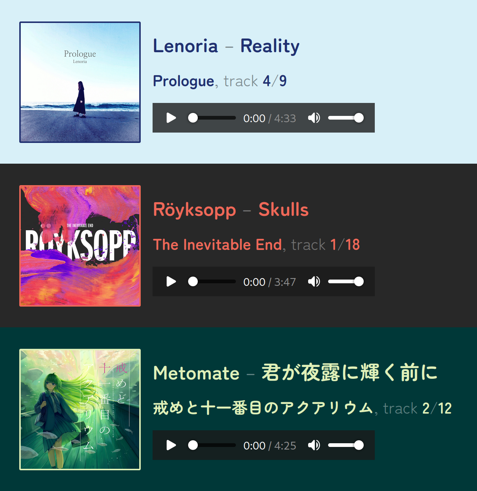

# verdure

A tiny web server that serves music files while displaying their metadata in a pretty way.

Three example screenshots:



## Usage

I made this for my own use and am publishing it mostly for reference. Don't expect much in the way of convenience.

It serves files from the `public/static` folder. For each audio file to be served, it should contain 2 files, the (properly tagged) music file as an ogg opus file named e.g. `melody.ogg`, and the album cover as an image file (png/jpg) named e.g. `melody`, without an extension. This would make the file available under e.g. `http://127.0.0.1:4567/melody`.

There is no further state or a database of any kind.

## Example `docker-compose.yml`

Assumes the image is built locally as `verdure`. If there is demand I might publish an image somewhere. Make sure to change the `OGP_BASE_PATH` to the path your verdure instance is available under, in order to make embeds on Discord etc. work correctly.

```yaml
services:
  verdure:
    image: verdure:latest
    restart: unless-stopped
    container_name: verdure
    volumes:
      - /home/user/verdure/library:/public/static
    environment:
      APP_ENV: "production"
      OGP_BASE_PATH: "https://example.com/verdure"
    ports:
      - 127.0.0.1:4567:4567
```
